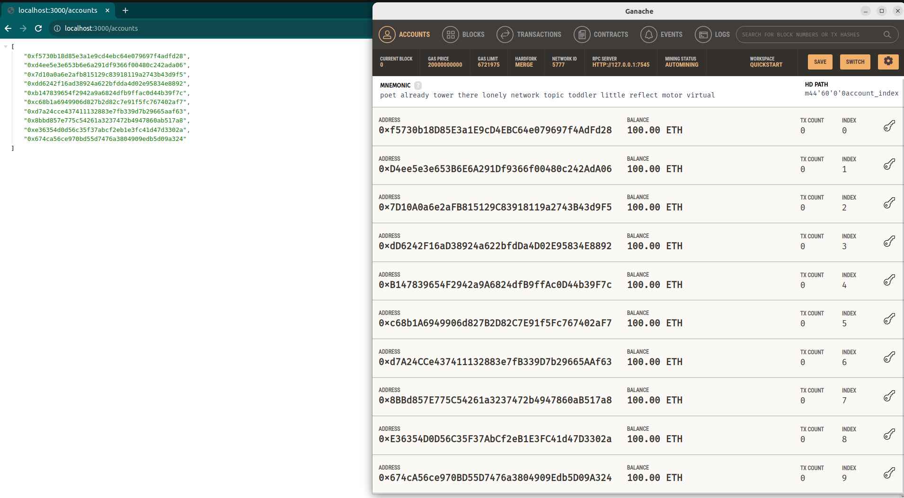
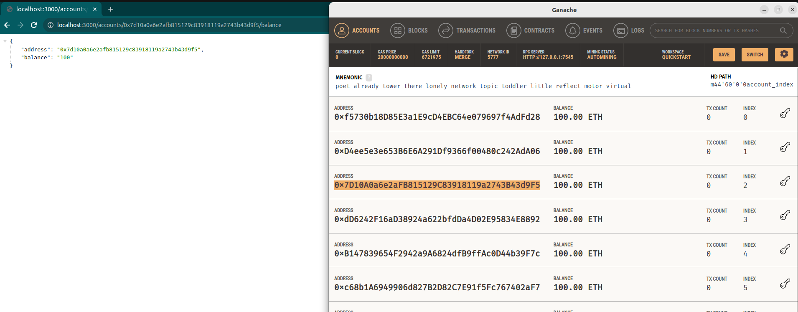
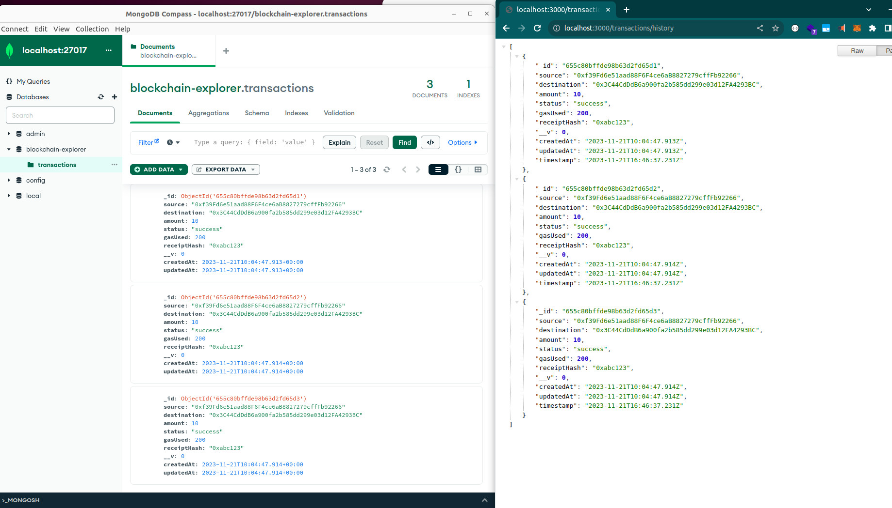
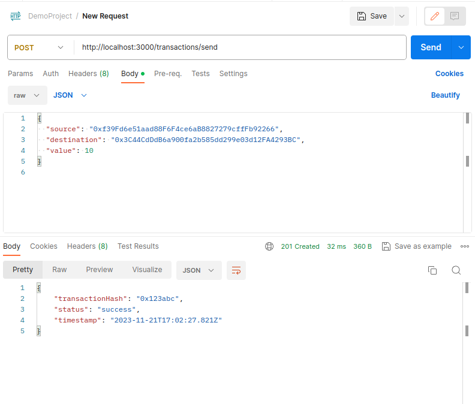
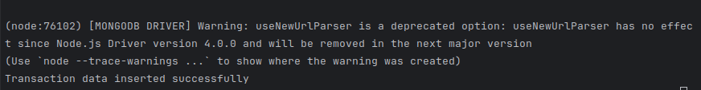
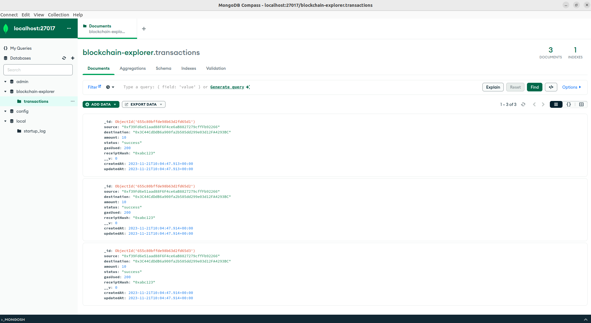
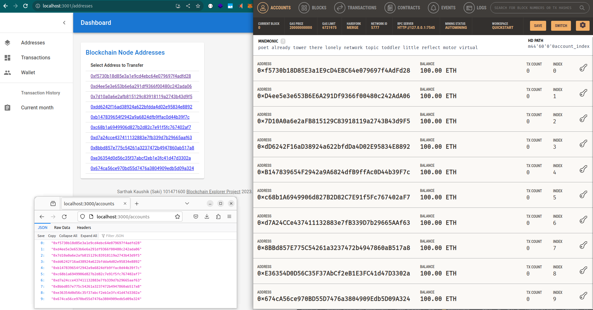
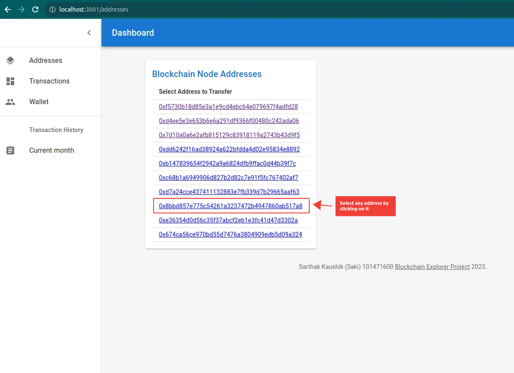
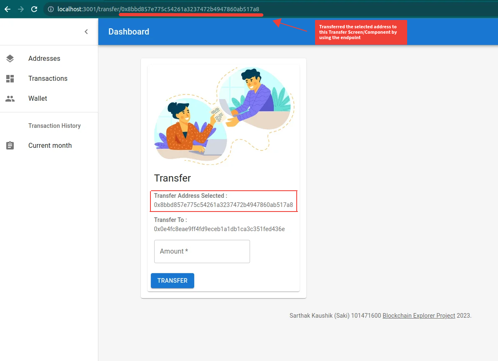
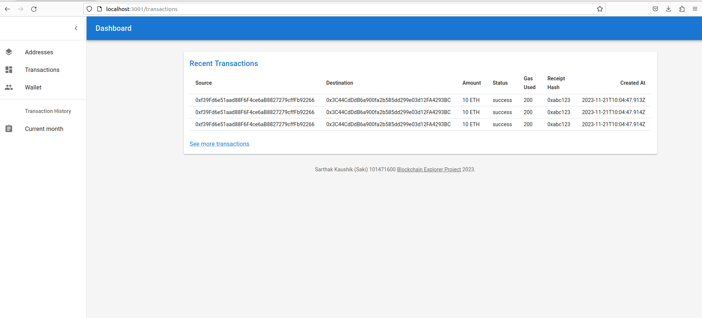

# FullStack Assignment Blockchain Completed

## Submission has ::

## backend-nestjs-server folder

### Which includes the following APIs

### 1. List of all addresses from Ganache
  

### 2. Get Balance for the Address API
  

### 3. Get list of all seeded transactions
  

### 4. Send Transaction API returning mocked receipt
  
         

## mongoDB-mongoose-script

## Seeds transactions data in the mongoDB using mongoose

### Console logs for the script


### Seeded Transactions (Output of the script)



## react-project folder

### Which includes

### 1. Ganache fetched addresses Screen
  

### 2. Data Transfer Through Route
  

  


- Selecting an address and viewing its balance fetched from Ganache
- Transfer Funds Screen (through two-way data binding)
- Successfully Transferred Funds Screen
- Transaction History Screen fetched data from mongodb using the nestjs API
  

  Above Showed Table is using the below shared API which fetches data from mongoDB
  


## Student Details

Sarthak Kaushik (101471600)


## Steps for running the project

In the project directory, run:

### For Database

Installation

```bash
$ npm install
```

Running the script

```bash
$ node seed.js
```


### For Backend

Installation

```bash
$ npm install
```

Running the backend

```bash
$ npm run start
```


### For Frontend

Installation

```bash
$ npm install
```

Running the frontend

```bash
$ npm start
```
