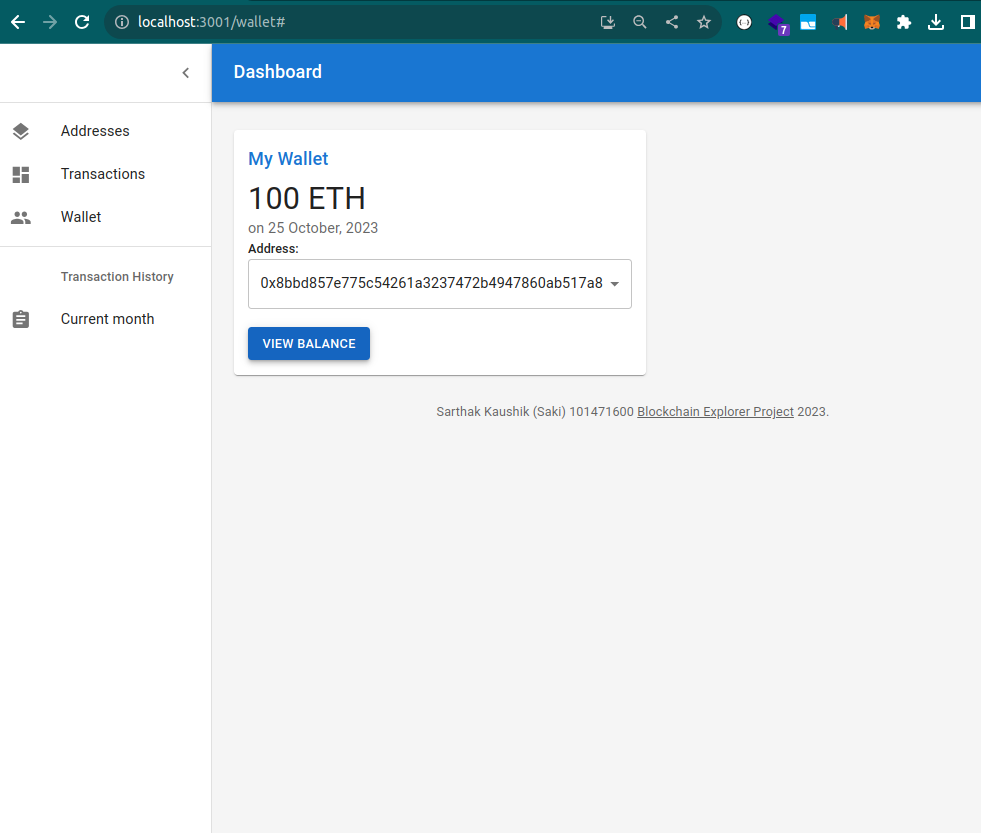

# FullStack Assignment Blockchain Completed

## Submission has ::

## backend-nestjs-server folder

### Which includes the following APIs

### 1. List of all addresses from Ganache


### 2. Get Balance for the Address API


### 3. Get list of all seeded transactions


### 4. Send Transaction API returning mocked receipt


## mongoDB-mongoose-script

## Seeds transactions data in the mongoDB using mongoose

### Console logs for the script


### Seeded Transactions (Output of the script)


## react-project folder

### Which includes

### 1. Ganache fetched addresses Screen


### 2. Data Transfer Through Route


### 3. Transfer Funds Screen (through two-way data binding) + Successfully Transferred Funds Receipt


### 4 Selecting an address to view its balance (Addresses in the select options are fetched using the nest js API getting data from Ganache)


### On click ``View Balance`` button, backend API gets triggered to fetch the balance of the selected address from Ganache


### Transaction History Screen fetched data from mongodb using the nestjs API


###  Above Showed Table is using the below shared API which fetches data from mongoDB


## Student Details

Sarthak Kaushik (101471600)


## Steps for running the project

### For Database

Setup MongoDB on Windows, following the three parts of step-by-step guide below

1. Go to MongoDB Community Server Download
2. Select Windows and msi, the current version and click Download
3. Once the msi file is downloaded, double-click on it
4. Windows Installer will start preparing to install
5. Click Next on MongoDB Setup Wizard
6. Accept the terms and click Next
7. Before selecting the setup type, Click on the Download shell now


1. Lands on the MongoDB shell download website
2. Select the package as zip, rest are defaults Windows and the latest version
3. Click on Download
4. Extract the downloaded file at LocalDisk/ProgramFiles/MongoDB/
5. Double-click the extracted folder to go inside it
6. Copy the path of the pinned file
7. Go to Edit the system environment
8. Click on Environment Variables
9. Click on Edit for System Variables
10. Paste the copied path
11. Save all by Okay


1. Go Back to the Setup Wizard now
2. Choose Complete option for Setup Type
3. Choose MongoDB as a service
4. Click the checkbox of Run service as Network Service user
5. Click on Next for the Server Configuration
6. Click the checkbox for Install MongoDB compass and Next
7. Allow for the permission popup
8. Click on finish
9. On the MongoDB Compass, Click on the start button on the popup
10. Click on connect


Open the project in Webstorm

In the project directory

Go to the database directory to seed the required data using the script


```bash
$ cd mongoDB-mongoose-script
```

Installation

```bash
$ npm install
```

Running the script

```bash
$ node seed.js
```


### For Backend

Go back to the main project directory and then to the backend folder

```bash
$ cd ../
$ cd backend-nestjs-server
```

Installation

```bash
$ npm install
```

Running the backend

```bash
$ npm run start
```


### For Frontend

```bash
$ cd ../
$ cd react-project
```

Installation

```bash
$ npm install
```

Running the frontend

```bash
$ npm start
```


### Ganache


1. Go to Truffle Suite Ganache Download Website
2. Click on Download (Windows)
3. Double-click on the downloaded file
4. Click Install on the popup
5. Click Launch once installation finishes
6. Click on Quickstart Ethereum
