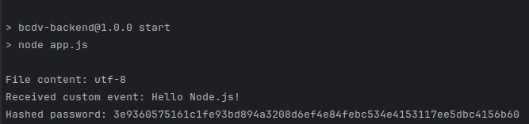

# Lab 1

Intermediate Node.js Fundamentals

- Modularizing File System
- Event Emitter
- Crypto Modules

## Output of the Project 

## Student Details

Sarthak Kaushik (101471600)

## For Running the project

In the project directory, run:

### `npm install`

### `npm start`