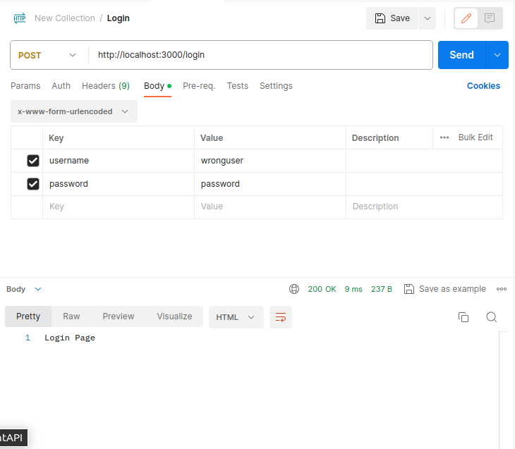
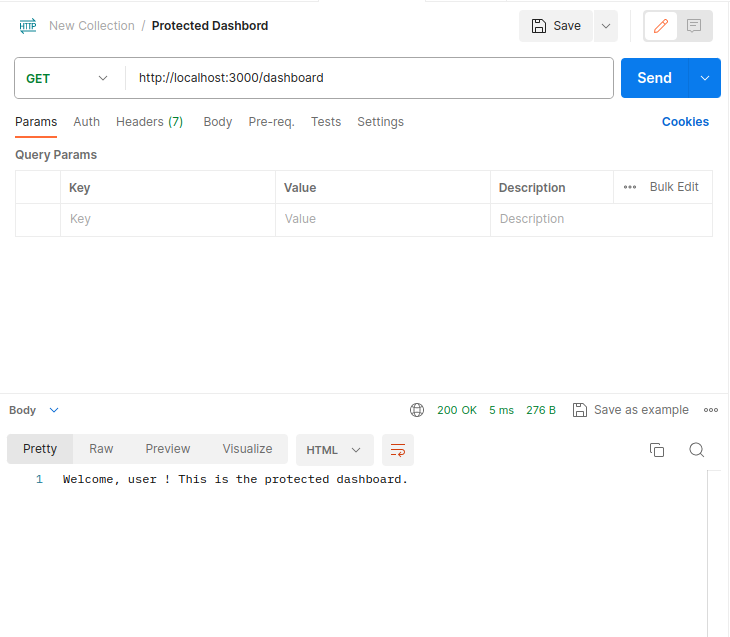

# Passport, Express, Node

Output of the project

POST Login /login

When credentials are correct, redirected to dashboard


POST Login /login

Login with incorrect credentials, redirected to login page



GET Dashboard /dashboard

Accessing the dashboard with the user



# Student Details

Sarthak Kaushik (101471600)


## Installation

```bash
$ npm install
```

## Running the app

```bash
$ node app.js
```


