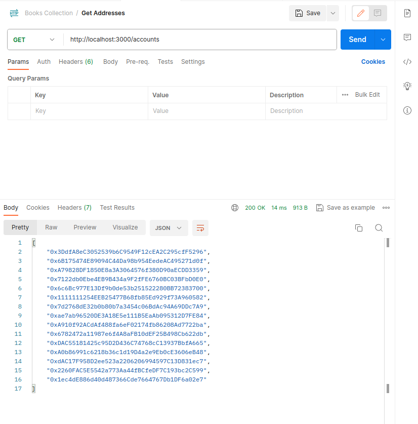
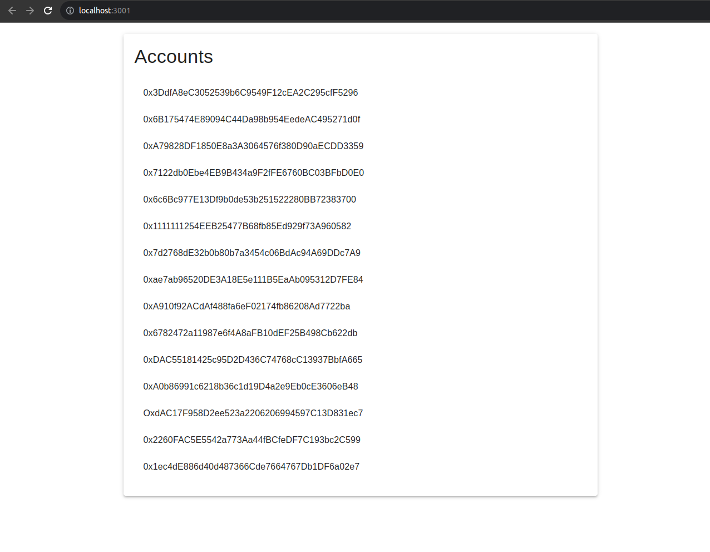

# Backend Web Dev Lab Test

Steps for running the backend 

```bash
$ cd backend-nestjs-server/

$ npm install

$ npm run start
```



Steps for running the frontend

```bash
$ cd axios-react-app/

$ npm install

$ npm start
```



# Student Details

Sarthak Kaushik (101471600)
